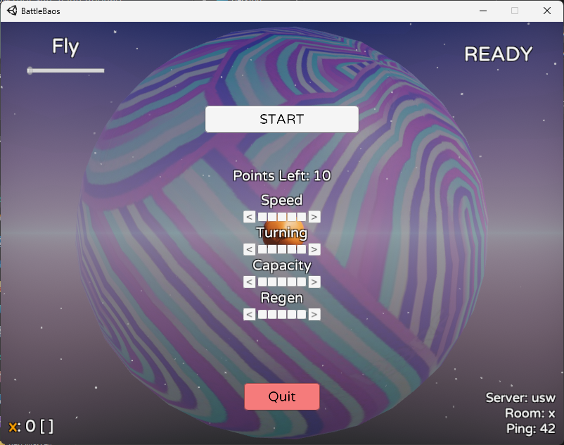
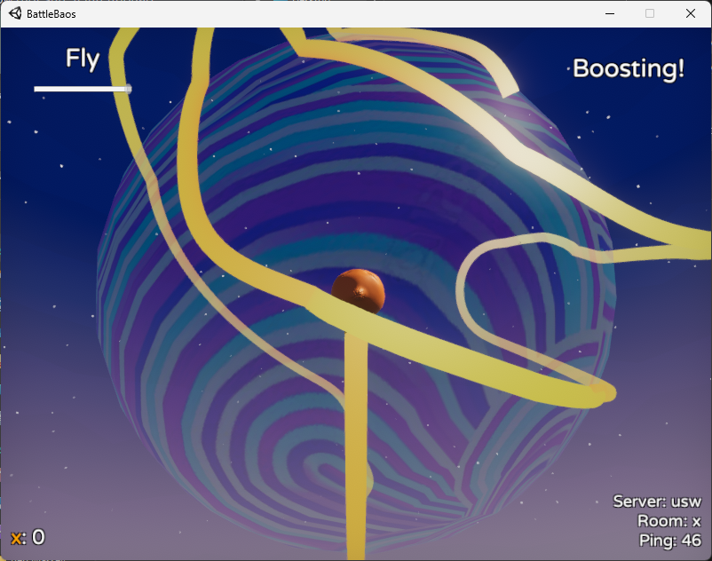
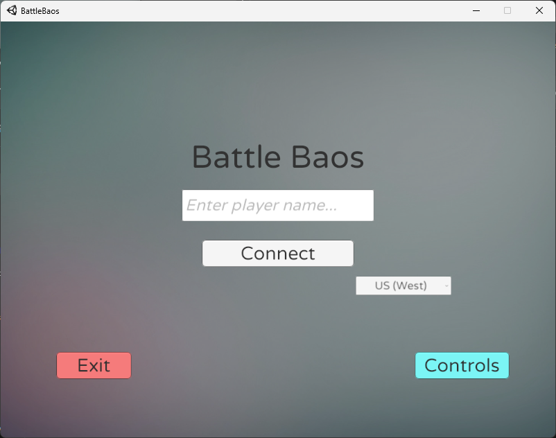

# Battle Baos

## Overview

This is a Unity project with C# for scripting and Photon's PUN for networking.

It hosts a battle online game, and is based on the previously existing game "Astro Bears".

Three key features are
- Online lobby functionality
- Controller and keyboard support
- Customizable character loadout

## Screenshots

## Credits

Feel free to contact me at benjamin.w.massey@gmail.com